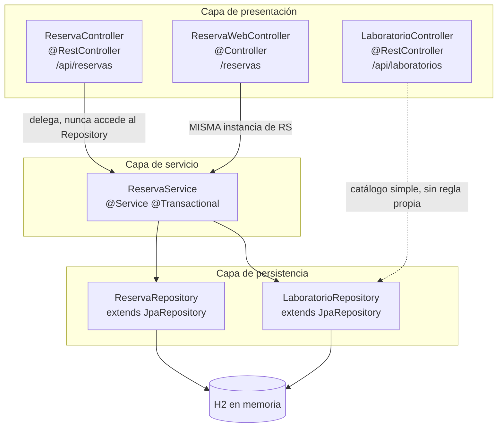
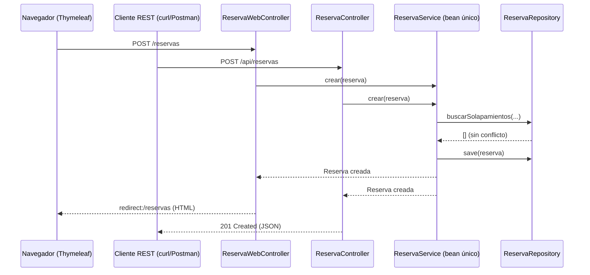
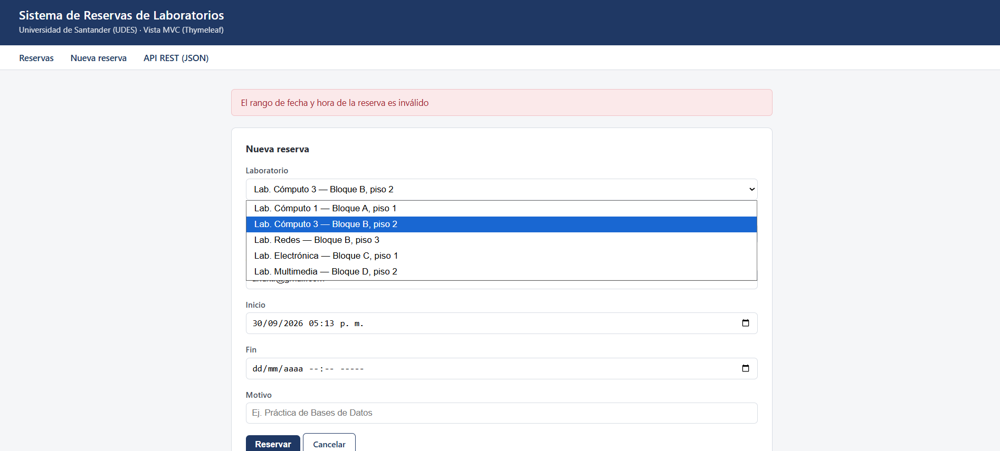
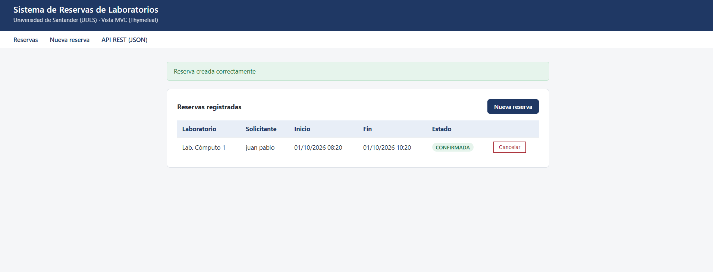
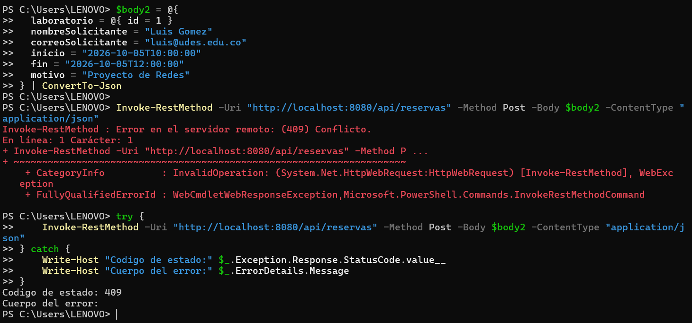
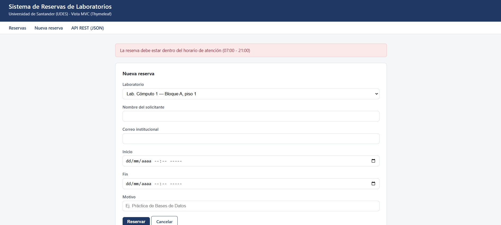
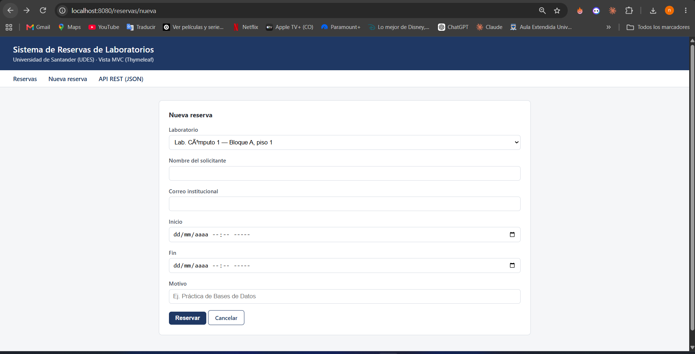
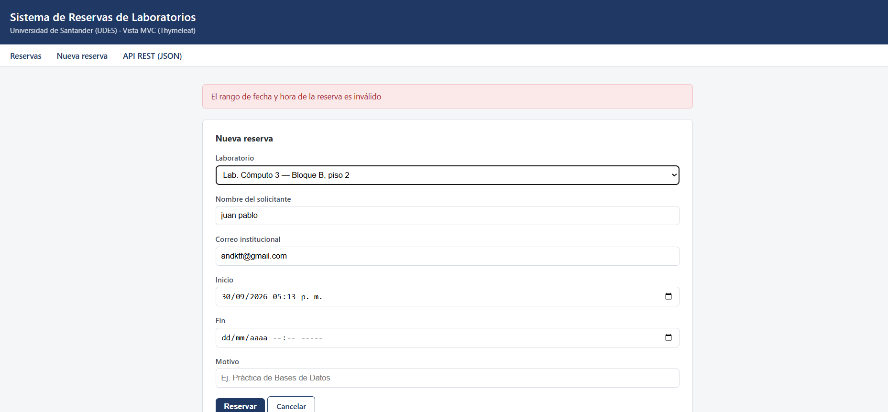
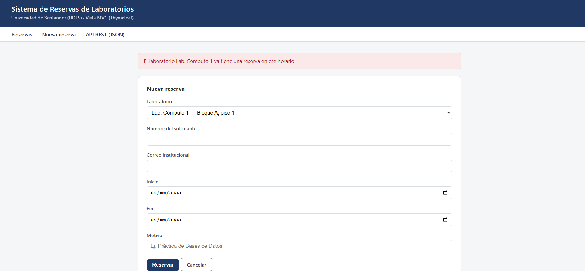

<div align="center">

# Sistema de Reservas de Laboratorios

**Post-contenido — Unidad 5 · Patrones de Diseño de Software**
Ingeniería de Sistemas · Universidad de Santander (UDES), sede Cúcuta


-1f3864?style=flat-square)


</div>

---

## Tabla de contenido

1. [Descripción](#descripción)
2. [Arquitectura](#arquitectura)
3. [Estructura del repositorio](#estructura-del-repositorio)
4. [Cómo ejecutar](#cómo-ejecutar)
5. [Endpoints de la API REST](#endpoints-de-la-api-rest)
6. [Rutas de la vista MVC](#rutas-de-la-vista-mvc)
7. [Reglas de negocio implementadas](#reglas-de-negocio-implementadas)
8. [Decisiones de diseño](#decisiones-de-diseño)
9. [Capturas de pantalla](#capturas-de-pantalla)
10. [Herramientas utilizadas](#herramientas-utilizadas)
11. [Conclusiones](#conclusiones)

---

## Descripción

Backend de un sistema de reserva de laboratorios de cómputo de la universidad, donde estudiantes y docentes reservan un laboratorio en un horario específico para una práctica o un proyecto de curso. El repositorio contiene **un único proyecto Spring Boot** desarrollado en dos partes que comparten exactamente la misma capa de dominio:

- **Parte 1 — API REST en capas.** Arquitectura completa `Entity → Repository → Service → Controller` sobre una base de datos H2 embebida, aplicando el patrón Repository con Spring Data JPA.
- **Parte 2 — Vista MVC con Thymeleaf.** Una interfaz web clásica que reutiliza, sin duplicarla, la misma capa `ReservaService` que ya usa la API REST.

El criterio que guía cada decisión de diseño de este repositorio no es "que el código funcione", sino que cada clase tenga una única razón de existir y que ninguna capa concentre responsabilidades que no le corresponden — ver la sección [Decisiones de diseño](#decisiones-de-diseño).

## Arquitectura



La única flecha "irregular" del diagrama es la de `LaboratorioController`, que accede directamente a `LaboratorioRepository`: es una decisión deliberada, no un descuido (ver [Decisiones de diseño](#decisiones-de-diseño)).

Lo que hace a esta arquitectura distinta de un MVC de un solo controlador es que **dos superficies de presentación —REST y Thymeleaf— convergen en el mismo `ReservaService`**:



La regla de negocio se evalúa **una sola vez**, en un único lugar, sin importar por cuál de las dos puertas haya entrado la solicitud.

## Estructura del repositorio

```
reservas-labs-api/
├── pom.xml
├── src/main/java/com/universidad/reservaslabs/
│   ├── ReservasLabsApiApplication.java
│   ├── model/            Entity — Laboratorio, Reserva, EstadoReserva
│   ├── repository/       Repository — LaboratorioRepository, ReservaRepository
│   ├── service/          Service — ReservaService (reglas de negocio)
│   ├── exception/        Excepciones de dominio + GlobalRestExceptionHandler
│   ├── controller/       Controller REST — LaboratorioController, ReservaController
│   └── web/              Controller MVC — ReservaWebController + su ExceptionHandler
├── src/main/resources/
│   ├── application.properties
│   ├── data.sql          catálogo inicial de laboratorios (demo)
│   ├── static/css/style.css
│   └── templates/reservas/  lista.html, nueva.html
└── src/test/java/...     ReservasLabsApiApplicationTests
```

## Cómo ejecutar

```bash
mvn clean package
mvn spring-boot:run
```

| Superficie      | URL                                      |
|-----------------|-------------------------------------------|
| API REST        | http://localhost:8080/api/reservas        |
| Vista MVC       | http://localhost:8080/reservas            |
| Consola H2      | http://localhost:8080/h2-console          |

La consola H2 se conecta con la URL JDBC `jdbc:h2:mem:reservas_labs_db`, usuario `sa` y contraseña en blanco. Al arrancar, `data.sql` precarga cinco laboratorios de ejemplo para poder probar la aplicación sin tener que dar de alta el catálogo manualmente.

## Endpoints de la API REST

| Verbo    | Ruta                                  | Descripción                                          | Éxito | Error de negocio |
|----------|----------------------------------------|-------------------------------------------------------|-------|-------------------|
| `GET`    | `/api/laboratorios`                   | Lista el catálogo de laboratorios                     | 200   | —                 |
| `GET`    | `/api/laboratorios/{id}`              | Obtiene un laboratorio                                | 200   | 404               |
| `POST`   | `/api/laboratorios`                   | Registra un laboratorio                               | 201   | 400 (validación)  |
| `GET`    | `/api/reservas`                       | Lista todas las reservas                              | 200   | —                 |
| `GET`    | `/api/reservas/{id}`                  | Obtiene una reserva                                   | 200   | 404               |
| `GET`    | `/api/reservas/laboratorio/{id}`      | Reservas de un laboratorio específico                 | 200   | —                 |
| `POST`   | `/api/reservas`                       | Crea una reserva                                      | 201   | 409 / 400         |
| `DELETE` | `/api/reservas/{id}`                  | Cancela una reserva                                   | 204   | 404 / 409         |

Ejemplos verificados en el desarrollo de este laboratorio:

```bash
# Reserva válida
curl -X POST http://localhost:8080/api/reservas \
  -H "Content-Type: application/json" \
  -d '{"laboratorio":{"id":1},"nombreSolicitante":"Ana Torres","correoSolicitante":"ana@udes.edu.co","inicio":"2026-08-10T09:00:00","fin":"2026-08-10T11:00:00","motivo":"Práctica de Bases de Datos"}'

# Mismo horario, mismo laboratorio -> 409 Conflict
curl -X POST http://localhost:8080/api/reservas \
  -H "Content-Type: application/json" \
  -d '{"laboratorio":{"id":1},"nombreSolicitante":"Luis Gómez","correoSolicitante":"luis@udes.edu.co","inicio":"2026-08-10T10:00:00","fin":"2026-08-10T12:00:00","motivo":"Proyecto de Redes"}'

# Fuera del horario de atención -> 400 Bad Request
curl -X POST http://localhost:8080/api/reservas \
  -H "Content-Type: application/json" \
  -d '{"laboratorio":{"id":1},"nombreSolicitante":"Carlos Ruiz","correoSolicitante":"carlos@udes.edu.co","inicio":"2026-08-10T22:00:00","fin":"2026-08-10T23:00:00","motivo":"Estudio nocturno"}'
```

## Rutas de la vista MVC

| Ruta                        | Método | Descripción                                          |
|------------------------------|--------|-------------------------------------------------------|
| `/reservas`                  | GET    | Lista de reservas con su estado                       |
| `/reservas/nueva`            | GET    | Formulario de creación                                |
| `/reservas`                  | POST   | Procesa el formulario (misma regla que la API REST)   |
| `/reservas/{id}/cancelar`    | POST   | Cancela una reserva desde la lista                    |

## Reglas de negocio implementadas

Todas viven en `ReservaService`, nunca en un Controller ni en un Repository:

1. **Horario de atención.** Toda reserva debe iniciar y terminar entre las 07:00 y las 21:00.
2. **Duración permitida.** Entre 30 minutos y 3 horas.
3. **Sin solapamiento.** No se permite una reserva cuyo rango se cruce con otra reserva activa (no cancelada) del mismo laboratorio.
4. **Cancelación oportuna.** No se cancela una reserva cuyo horario de inicio ya pasó.

## Decisiones de diseño

Este laboratorio marcó explícitamente cuatro puntos de decisión, sin indicar la respuesta correcta. A continuación se documenta qué se decidió en cada uno y por qué la alternativa descartada era peor para este caso.

### Punto de decisión 1 — Dónde vive la validación de solapamiento

**Decisión:** el filtrado de solapamientos se resuelve en la base de datos, con la consulta JPQL `ReservaRepository.buscarSolapamientos`; la decisión de negocio sobre qué hacer con ese resultado (lanzar `ReservaConflictException`) la toma exclusivamente `ReservaService`.

**Por qué no la alternativa (traer todas las reservas del laboratorio a memoria y comparar rangos en Java puro):** esa alternativa obliga a cargar en memoria una colección que crece sin límite con el tiempo — un laboratorio activo durante varios semestres puede acumular miles de reservas históricas — para descartar en cada creación casi todas ellas. La consulta JPQL, en cambio, deja que el motor de base de datos use el índice sobre `laboratorio_id` y descarte la inmensa mayoría de filas antes de que lleguen a la aplicación. El Repository responde una pregunta de datos ("¿qué reservas se solapan con este rango?"); el Service responde una pregunta de negocio ("¿se permite crear esta reserva?").

**Qué pasaría si el Controller llamara directamente a `buscarSolapamientos()` sin pasar por el Service:** el Controller tendría que decidir por su cuenta qué significa que la lista no esté vacía, duplicando en la capa HTTP una decisión que le corresponde al dominio. Peor aún, un segundo Controller (o un futuro job por lotes) que también necesite crear reservas tendría que reimplementar el mismo `if (!solapamientos.isEmpty())`, exactamente el escenario de duplicación que la capa Service existe para evitar.

### Punto de decisión 2 — Reglas con y sin apoyo del Repository

**Decisión:** `validarHorarioYDuracion` vive enteramente en `ReservaService`, con Java puro (`LocalTime`, `Duration`), sin tocar el Repository ni la base de datos.

**Criterio general aplicado:** si la regla necesita comparar el objeto que se está validando contra datos que solo la base de datos conoce (otras reservas ya existentes), conviene apoyarse en una consulta del Repository, como en el Punto de decisión 1. Si la regla solo depende de los campos propios del objeto que se está validando —el horario de atención y la duración dependen únicamente de `inicio` y `fin` de la propia reserva—, no hay ninguna razón para involucrar al Repository: hacerlo agregaría una consulta a la base de datos (con su correspondiente costo de red y de conexión) para responder una pregunta que ya se puede responder con los datos que la aplicación tiene en memoria en ese mismo instante.

### Punto de decisión 3 — Cómo comparten Service el Controller MVC y el REST

**Decisión:** `ReservaWebController` (Parte 2) y `ReservaController` (Parte 1) reciben por constructor la misma clase `ReservaService`, gestionada por Spring como un único bean *singleton*. Ninguno de los dos controladores reimplementa la validación de solapamiento ni la de horario.

**Por qué no la alternativa (copiar la validación dentro de `ReservaWebController`, o crear un segundo `ReservaWebService` casi idéntico):** cualquiera de las dos opciones habría hecho que corregir la regla de solapamiento en el futuro requiriera cambiarla en dos lugares — y, en la práctica, ese tipo de duplicación es exactamente la que termina divergiendo con el tiempo, cuando alguien corrige la regla en un Service y olvida corregirla en el otro. Compartir la instancia no es solo más corto de escribir: es la única forma de garantizar que la API REST y la vista web apliquen siempre el mismo criterio de negocio.

### Punto de decisión 4 — Manejo de errores consistente entre MVC y REST

**Decisión:** dos manejadores de excepciones separados —`GlobalRestExceptionHandler`, restringido con `annotations = RestController.class`, y `ReservaWebExceptionHandler`, restringido con `assignableTypes = ReservaWebController.class`— traducen las mismas excepciones de dominio (`ReservaConflictException`, `RecursoNoEncontradoException`) a una respuesta JSON o a una redirección con mensaje, respectivamente.

**Por qué no un único `@RestControllerAdvice` global que "detecte" el origen de la petición:** un `@RestControllerAdvice` serializa siempre a JSON, así que forzarlo a devolver HTML habría exigido inspeccionar el encabezado `Accept` y ramificar manualmente cada método `@ExceptionHandler` según el resultado de esa inspección. Eso añade una rama condicional por cada excepción de dominio que exista, y crece con cada excepción nueva. Dos manejadores, cada uno restringido a su tipo de controlador, mantienen la misma separación de responsabilidades que el resto del proyecto: una clase por superficie de presentación, ambas alimentadas por el mismo vocabulario de excepciones.

## Capturas de pantalla

- [x] `GET /api/laboratorios` en Postman/curl — catálogo cargado desde `data.sql`.
  

- [x] `POST /api/reservas` exitoso — 201 Created.
  

- [x] `POST /api/reservas` con horario solapado — 409 Conflict con el mensaje de negocio.
  

- [x] `POST /api/reservas` fuera de horario de atención — 400 Bad Request.
  

- [x] `/reservas` en el navegador — lista con al menos una reserva confirmada.
  

- [x] `/reservas/nueva` en el navegador — formulario con el catálogo de laboratorios cargado.
  

- [x] `/reservas/nueva` mostrando el mismo mensaje de conflicto de horario que ya devuelve la API REST en JSON (evidencia del Punto de decisión 4).
  

## Herramientas utilizadas

- Java 17, Spring Boot 3.2, Spring Data JPA, Spring Validation, Thymeleaf
- Base de datos H2 (embebida)
- Apache Maven
- Postman / curl para pruebas de la API REST
- Git y GitHub para control de versiones

## Conclusiones

Construir las dos partes sobre el mismo proyecto, en lugar de dos aplicaciones separadas, hizo visible algo que un ejercicio aislado no muestra: el verdadero valor de la capa Service no aparece cuando se la escribe, sino cuando una segunda superficie de presentación —en este caso la vista Thymeleaf— necesita exactamente las mismas reglas que ya existían para la API REST. Lo más difícil de decidir no fue implementar la regla de solapamiento en sí, sino trazar la línea entre qué pertenece al Repository (filtrar datos) y qué pertenece al Service (decidir qué significan esos datos para el negocio); esa línea se vuelve más clara al preguntar si la regla necesita o no consultar otras filas de la base de datos, más que al pensar en términos de "dónde se ve más limpio el código". Mantener a `LaboratorioController` como la única excepción deliberada a la arquitectura en capas —documentada, no accidental— terminó siendo tan formativo como el resto: entender cuándo una capa Service *no* aporta nada es tan importante como saber construir una que sí lo hace.
